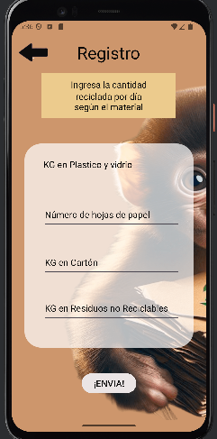

# readme.md
Bienvenidos a todos a nuestra app de Ecorecicla con MonkeyRecycle

# ¿En que consiste la app?
EcoRecicla se ha desarrollado con el propósito de abordar varios aspectos críticos de la gestión de residuos y reciclaje, con un enfoque en la educación, el seguimiento y la optimización de prácticas sostenibles.

# Vista previa del proyecto

lOGIN

HOME

CATEGORIES

REGISTRATION

STATISTICS

TIPS

# Diagrama de flujo del ciclo de vida de la aplicación

